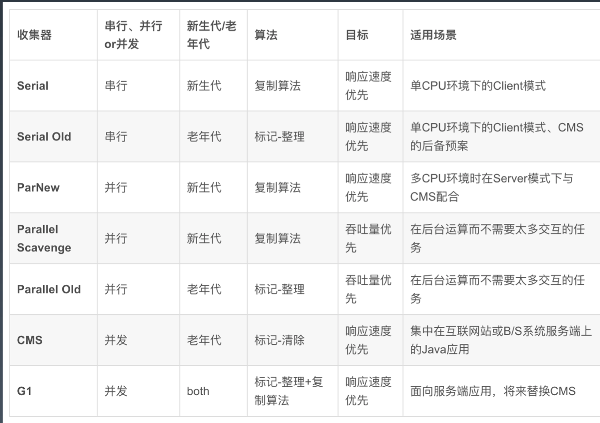

学习笔记

###### 字节码的生成

编译:javac .java文件

查看字节码:javap -c  (-verbose参数查看更详细的内) .class文件

字节码与汇编语言类似

###### 类的生命周期

1. 加载(Loading):找 Class 文件
2. 验证(Verification):验证格式、依赖
3. 准备(Preparation):静态字段、方法表
4. 解析(Resolution):符号解析为引用
5. 初始化(Initialization):构造器、静态变 量赋值、静态代码块
6. 使用(Using)
7. 卸载(Unloading)

类会在某些情况下被加载，但不一定被初始化

初始化时机：main方法，new对象时，被调用的静态方法，被访问的静态字段，子类初始化会触发父类的初始化，接口定义了default方法直接实现或者间接实现该接口时都会触发该接口的初始化，使用反射API对某个类进行反射调用时初始化，初次调用methodhandle实例时

不初始化时机：子类引用父类的静态字段不会触发子类的初始化，定义对象数组时，通过类名获得class对象，通过class.forname加载指定类时第二参数就是是否初始化，classloader默认的loadcalss方法加载不会初始化

###### 三类加载器:

1. 启动类加载器(BootstrapClassLoader) 
2. 扩展类加载器(ExtClassLoader)
3. 应用类加载器(AppClassLoader)

加载器特点: 1. 双亲委托 2. 负责依赖 3. 缓存加载

###### 添加引用类的几种方式

1、放到 JDK 的 lib/ext 下，或者-Djava.ext.dirs
 2、 java –cp/classpath 或者 class 文件放到当前路径
 3、自定义 ClassLoader 加载
 4、拿到当前执行类的 ClassLoader，反射调用 addUrl 方法添加 Jar 或路径(JDK9 无效)。

###### JVM命令行工具

​	jps/jinfo	查看java进程

​	jstat			查看jvm内部gc相关信息

​	jmap			查看heap或类占用统计

​	jstack			查看线程信息

​	jcmd			执行jvm相关分析命令

​	jrunscript/jjs 	执行js命令

###### Jvm图形化工具

jconsole		Avisualvm	jmc		idea插件：visualGC

###### GC

java8默认就是并行gc ParallelGC

###### Parallel

并行垃圾收集器主要考虑吞吐量，在gc期间会STW，gc后业务进程能够对系统资源有效的使用

###### CMS

cms主要是使得延迟更低，默认使用cpu的核心线程数四分之一的线程，主要用于老年代，新生代使用parnew

- 阶段  1: Initial Mark(初始标记)
- 阶段  2: Concurrent Mark(并发标记)
- 阶段  3: Concurrent Preclean(并发预清理)
- 阶段  4: Final Remark(最终标记)
- 阶段  5: Concurrent Sweep(并发清除)
- 阶段  6: Concurrent Reset(并发重置)

###### G1

不再分老年代和年轻代而是将整个堆内存分为小的区域，可以根据垃圾多的区域优先收集，延迟较低

内存大的时候使用G1为好

